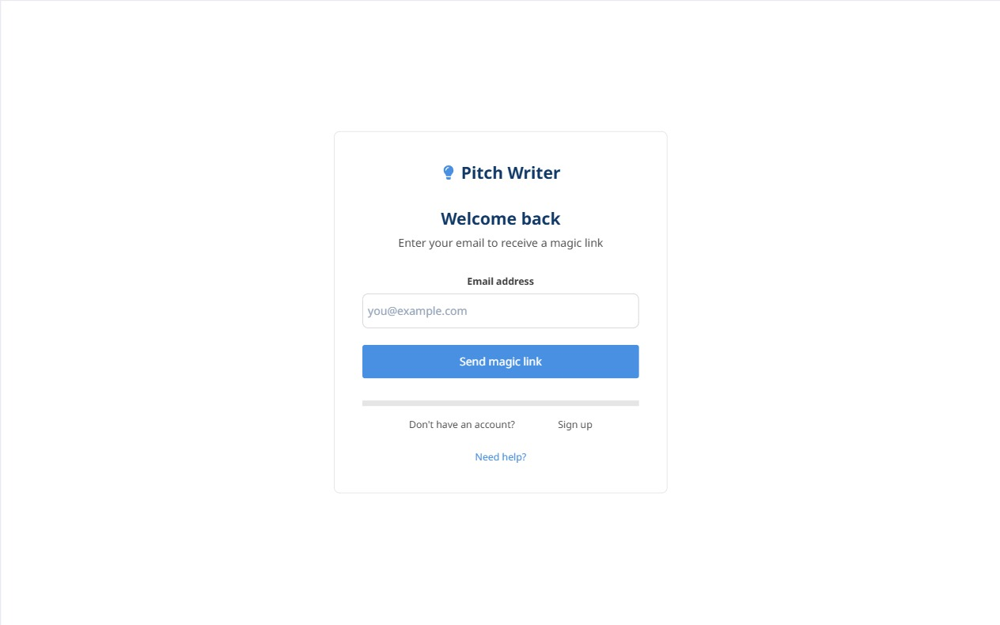
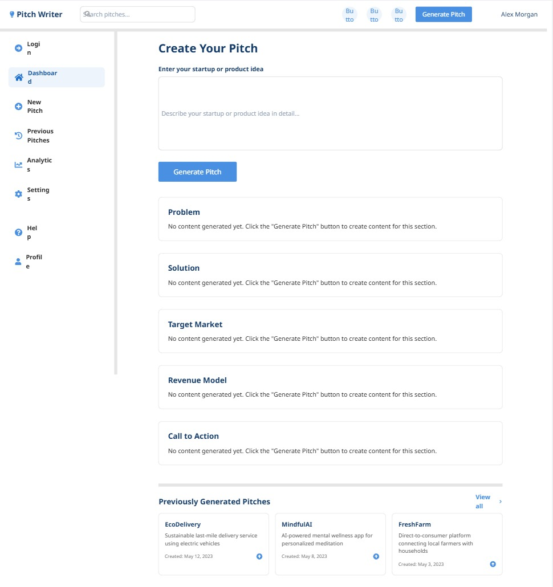
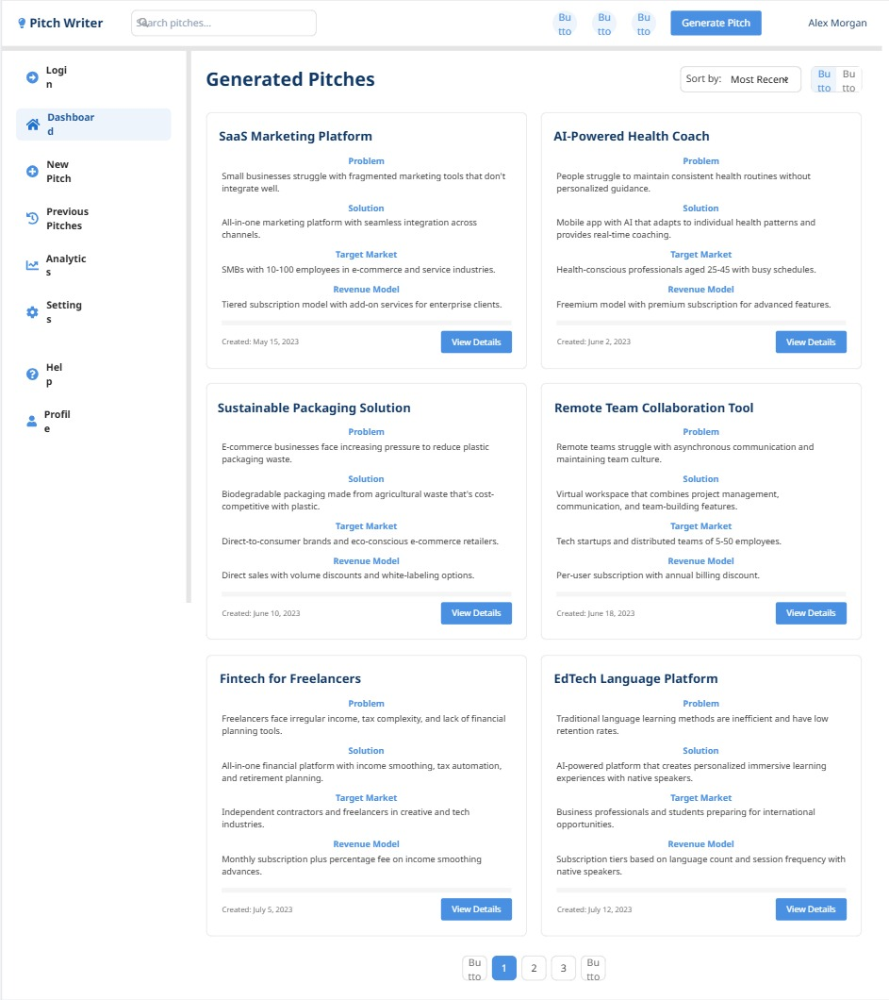
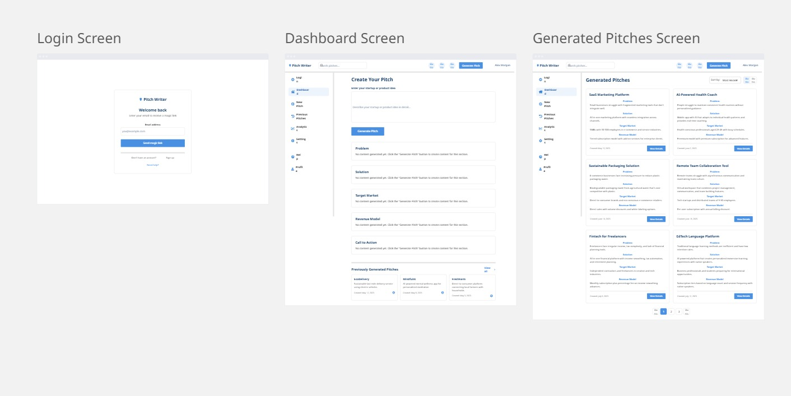

# 📐 Wireframes: Pitch Writer

---

## 1. 🟢 Login Screen (Magic Link)

**Description:**  
A simple login screen that asks for the user's email. Clicking "Send Magic Link" authenticates via Supabase.

**Screenshot:**  

---

## 2. 🟡 Dashboard (Idea Input + Pitch Output)

**Description:**  
Main UI for entering the startup idea and generating the pitch. Contains:
- A large text input box
- “Generate Pitch” button
- Output area below with labeled sections

**Screenshot:**  

---

## 3. 🔵 Pitch Output Sections

**Description:**  
The AI-generated pitch is divided into structured sections:
- Problem  
- Solution  
- Target Market  
- Revenue Model  
- Call to Action

**Screenshot:**  

---

## 4. 🗂 Workflow 

**Screenshot:**  

